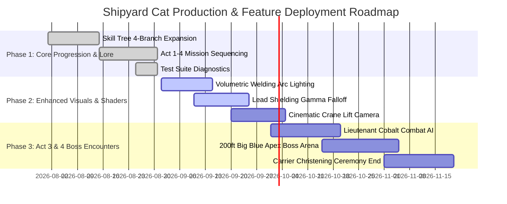

# SHIPYARD CAT: GAME DESIGN DOCUMENT & STRATEGIC ROADMAP
**The Definitive Narrative Progression, Systems Architecture & Production Roadmap**  
**Setting:** Newport News Shipbuilding (NNS), James River, Virginia (2.5-Mile Historic Industrial Facility)  
**Lead Narrative & Progression Architect:** Systems Design & Technical Art Division  
**Document Version:** 3.0 (Master Production Specification)

---

## 1. Executive Summary & Core Pillars

*Shipyard Cat* is a third-person narrative action-simulation and stealth exploration game where players inhabit **Alba**, a sleek black domestic short-hair with an active LCD collar dosimeter, serving as the official Master Mouser across the historic 550-acre complex of Newport News Shipbuilding.

```
                           SHIPYARD CAT CORE GAMEPLAY MATRIX
                                          │
        ┌───────────────────┬─────────────┴─────┬───────────────────┐
        ▼                   ▼                   ▼                   ▼
[FELINE AGILITY]     [PREDATOR COMBAT]   [WHISKERS SONAR]    [RAD RESILIENCE]
• Micro-Steering     • 3-Hit Claw Combo  • Scent Tracking    • Lead-Lined Fur
• Catwalk Mantling   • 360° Tail Sweep   • Radiation Auras   • Dosimeter Boost
• Righting Reflex    • Shadow Finisher   • Geiger Sonar      • Bio-Resilience
```

### 1.1 The Four Core Feline Pillars
1. **Authentic Diegetic Shipyard Simulation:** Every location—from the 1891 tugboat *Dorothy* (NNS Hull No. 1) to the 1,050-ton *Big Blue* Goliath crane and the RCOH nuclear submarine overhaul vaults—is faithfully recreated with industrial PBR fidelity, warm sodium vapor lighting ($2200\text{K}$), and mercury vapor arc-welding accents ($6500\text{K}$).
2. **True Feline Locomotion & Senses:** Responsive zero-momentum micro-steering, tactile mantling along narrow steel I-beams, mid-air righting reflexes, and tiered *Whiskers Vision* revealing neon scent trails, electromagnetic conduits, and isotopic radiation auras.
3. **Accidental Shipbuilding Assistance:** Alba's natural mousing instincts unintentionally solve critical shipyard engineering bottlenecks—unjamming seized mooring capstans, pulling pilot conduit strings through submarine bulkheads, and tripping emergency crane safety breakers.
4. **Radiological Hazard & Survival:** Diegetic radiation telemetry via Alba's collar LCD screen and audio Geiger counter clicks, demanding stealth, lead shielding navigation, and bio-resilience progression.

---

## 2. The 4 Epic Narrative Acts

```
ACT 1: WHARF RATS & DOROTHY           ACT 2: GANTRY'S FELINE INSURGENCY & DD12 FLOOD
• Historic South Yard & Dry Dock 1     • Dry Dock 12 CVN Supercarrier Basin
• Mo Kelly & Welder Apprenticeship     • Emergency Sluice Sabotage & Tidal Surge
• Boss: The Dockyard Kingpin           • 200ft Big Blue Modular Crane Superlift
                 │                                      │
                 ▼                                      ▼
ACT 3: NUCLEAR SUBMARINE KEEL         ACT 4: 200FT BIG BLUE APEX & CORONATION
• Submarine MOF & RCOH Lead Vault      • Cat Motel Sanctuary Nursery Siege
• Isotopic Hotspot Navigation          • 200ft Goliath Crane Catwalk Ascent
• Boss: Lieutenant Cobalt              • Climax Boss: Gantry the Polydactyl Overlord
```

---

### Act 1: Wharf Rats & Dorothy (The South Yard Initiation)
* **Setting:** Historic South Yard, Washington Avenue Rail Spurs, Red-Brick Machine Shop No. 1, and the dry-mounted 1891 Tugboat *Dorothy*.
* **Narrative Arc:**
  Alba begins as a young yard kitten under the watchful care of Welder Mo Kelly (Dept. 11) and EH&S Specialist Dr. Elena Vance. A sudden swarm of aggressive river wharf rats, coordinated by the scarred **Dockyard Kingpin**, threatens to gnaw through critical pneumatic control lines along the historic Dry Dock 1 basin. Alba learns to stalk prey, leap across stacked oak staging crates, and hunt vermin to sustain her vitals.
* **Key Missions & Milestones:**
  1. *Chapter 1: The Rigger's Whistle* — Hunt 2 shipyard mice along rail spurs, descend via crate stairs into the sunken Dry Dock 1 trough ($-2.0\text{m}$), and corner the Dockyard Kingpin.
  2. *Chapter 2: Dorothy's Historic Steamline* — Climb onto Tugboat *Dorothy's* foredeck ($+2.2\text{m}$), chase the Kingpin behind the anchor windlass, and unjam the seized capstan winch, earning the first Shipbuilding Assist award (+150 XP).
* **Boss Encounter: The Dockyard Kingpin**
  * *Arena:* Timber keel blocks of Historic Dry Dock 1.
  * *Mechanics:* Heavy charge attacks, metal scrap armor plating requiring 3-hit Claw Flurry to crack, and rodent reinforcements.
  * *Reward:* Title of *Apprentice Shipyard Cat* & Tugboat Dorothy Brass Commemorative Medal.

---

### Act 2: Gantry's Feline Insurgency & Dry Dock 12 Flood
* **Setting:** Dry Dock 12 (2,172-foot CVN Supercarrier Basin), Goliath Crane rail tracks, mobile module transporters, and elevated staging catwalks.
* **Narrative Arc:**
  A rogue clowder of radioactive, polydactyl feral cats known as *Gantry's Insurgents* emerges from the RCOH scrap staging yards. Led by the hulking mutant Maine Coon **Gantry**, they sabotage the emergency sluice gate of Dry Dock 12, unleashing a massive tidal surge from the James River into the carrier dry dock basin.
* **Key Missions & Milestones:**
  1. *Chapter 3: Tide Rising in Dry Dock 12* — Sprint to the southern rim of Dry Dock 12 as water rushes in at $0.12\text{ m/s}$. Leap across floating wooden pallets, dodge floating debris, and scramble up yellow staging ladders ($+3.5\text{m}$) before the basin floods.
  2. *Chapter 4: Big Blue's High-Wire Superlift* — Ascend to the Goliath crane gantry tracks, ride a prefabricated carrier deck module $200\text{ft}$ into the air across the yard, and trip the crane runaway safety trip to save Rigging Foreman Frank 'Sarge' Miller.
* **Environmental Mini-Game: The 200ft Crane Lift Aerial Vista**
  * Alba curls up inside the crane's rigging basket; the camera pans out into a sweeping cinematic vista of the entire James River waterfront and sunset shipyard skyline.
* **Boss Skirmish: Mutant Scouts Slag & Fang**
  * *Mechanics:* High-velocity pounce attacks, glowing radioactive eyes in darkness, synchronized flanking maneuvers.
  * *Reward:* Title of *Senior Rigger Mouser* & Unlocking Branch 4 (Radiation Resilience).

---

### Act 3: Nuclear Submarine Keel & Lead Containment Vault
* **Setting:** Submarine Modular Outfitting Facility (MOF), Refueling & Complex Overhaul (RCOH) Zone, Decommissioned Core Storage Vault, and Lead-Shielded Staging Tents.
* **Narrative Arc:**
  Gantry's second-in-command, **Lieutenant Cobalt**, establishes an insurgent stronghold inside the lead-shielded RCOH radiological containment zone. Cobalt is hoarding spent isotopic shielding blocks, causing radiation leakage that threatens submarine overhaul schedules. Alba must rely on her dosimeter collar and Tier 3 Whiskers Vision (*Geiger Sonar*) to navigate gamma radiation hotspots.
* **Key Missions & Milestones:**
  1. *Chapter 5: Mutants in the Machine Shop* — Infiltrate Machine Shop No. 1 through narrow cat flaps, sneak under heavy CNC milling benches, neutralize mutant scouts, and follow violet gamma isotope trails toward the Submarine MOF.
  2. *Chapter 6: Shadows in the Shielding* — Traverse the high-radiation RCOH containment tent ($5.0\text{–}50.0\text{ mSv/hr}$), keeping behind high-density lead barrier blocks to minimize dosimeter accumulation. Trip the emergency secondary coolant valve and confront Lieutenant Cobalt.
* **Boss Encounter: Lieutenant Cobalt**
  * *Arena:* Submarine reactor mock-up stage surrounded by lead shielding and arcing conduit rails.
  * *Mechanics:* Ionized claw swipe combos, 480V third-rail knockback hazards, and periodic radiation spikes requiring Alba to take shelter behind lead curtains.
  * *Assist Trigger:* Accidental Sonar Conduit Threading (Alba pulls the pilot string through a narrow $4''$ bulkhead pipe, saving 120 man-hours).
  * *Reward:* Title of *Lead Containment Specialist* & Isotope Collar Shielding Tag.

---

### Act 4: 200ft Big Blue Apex & Master Mouser Coronation
* **Setting:** The Cat Motel TNR Sanctuary, Cardboard Condo Nursery, 1,050-ton *Big Blue* Goliath Crane Trolley Bridge ($200\text{ft}$ elevation), CVN Flight Deck Staging.
* **Narrative Arc:**
  In a desperate final assault, Gantry orders his entire mutant pack to besiege the Cat Motel clinic to destroy the sanctuary and sever the ceremonial christening launch cables for the new aircraft carrier. Alba must rally her colony allies, defend the orphaned kitten nursery, and pursue Gantry up the 200-foot vertical steel legs of Big Blue for a legendary confrontation in the midst of a sunset storm over the James River.
* **Key Missions & Milestones:**
  1. *Chapter 7: Siege of the Cat Motel Sanctuary* — Stand guard on the clinic porch alongside Calico Belle and Tripod Toby, repelling 4 waves of mutant invaders. Meow inside the cardboard condo nursery to soothe frightened kittens.
  2. *Chapter 8: The Apex Showdown on Big Blue* — Ascend the crane girder elevator hoist to the main trolley bridge ($Y = 36\text{m} \approx 200\text{ft}$). Engage Gantry across narrow crane catwalks, avoid high-voltage hoist rails, and knock him into the safety net.
* **Climax Boss: Gantry the Polydactyl Overlord**
  * *Phase 1 (Catwalk Chase):* Maneuver across wind-swept crane I-beams; dodge heavy crane hook swings.
  * *Phase 2 (Isotopic Static Shield):* Gantry radiates a high-energy static field; Alba must use *Tail Sweep* to stun and *Shadow Finisher* to strike during cooldown windows.
  * *Phase 3 (Apex Trolley Duel):* High-intensity duel atop the 1,050-ton hoist housing above Dry Dock 12.
* **The Grand Finale: Master Mouser Coronation**
  * The shipyard whistle blasts across Newport News. Dr. Elena Vance and the Shipyard President award Alba the solid brass **Master Mouser of Newport News Medal** at the CVN carrier christening ceremony.

---

## 3. Comprehensive 4-Branch Ability Skill Tree

```
                       ALBA'S 4-BRANCH FELINE SKILL TREE
                                       │
     ┌───────────────────┬─────────────┴─────┬───────────────────┐
     ▼                   ▼                   ▼                   ▼
[BRANCH 1: AGILITY] [BRANCH 2: COMBAT] [BRANCH 3: SENSES] [BRANCH 4: RADIATION]
Tier 1: Spring Paws Tier 1: Claw Combo Tier 1: Scent Trail Tier 1: Lead Fur
Tier 2: Beam Walker Tier 2: Tail Sweep Tier 2: Mutant Aura Tier 2: Iodine Wash
Tier 3: Righting    Tier 3: Shadow Fin Tier 3: Geiger Sona Tier 3: Rad Boost
Tier 4: Apex Sprint Tier 4: Frenzy     Tier 4: 6th Sense   Tier 4: Bio-Shield
```

### 3.1 Skill Tree Matrix & Gameplay Modifiers

| Branch & Tier | Perk ID | Perk Name | Cost | In-Game Mechanics & Modifiers | Diegetic Shipyard Lore |
| :--- | :--- | :--- | :---: | :--- | :--- |
| **Agility T1** | `SPRING_PAWS` | **Spring-Steel Paws** | 1 SP | Vertical jump height $\times 1.45$ ($9.0\text{ m/s}$). Allows leaping onto high staging crates & boat decks. | *"Watched her leap right onto a four-foot steel plate like gravity didn't apply." - Mo Kelly* |
| **Agility T2** | `BEAM_WALKER` | **Beam Walker & Balancer** | 2 SP | Zero movement wobble on narrow I-beams & pipe runs. Movement speed on catwalks increased by $+25\%$. | *"Riggers spend years getting their sea legs on crane catwalks. She was born with them."* |
| **Agility T3** | `ALWAYS_LAND_FEET` | **Righting Reflex** | 2 SP | Complete immunity to fall damage from any elevation. Mid-air spine rotation animation enabled. | *"Dropped 40 feet off the gantry catwalk, twisted mid-air, and landed on all four paws."* |
| **Agility T4** | `APEX_CATWALK_SPRINTER` | **Apex Catwalk Sprinter** | 3 SP | Infinite sprint stamina while aloft on elevated structures ($>3\text{m}$). Wall-bounce mantle enabled. | *"She flies across the top girder of Big Blue faster than the wind off Hampton Roads."* |
| **Combat T1** | `CLAW_FLURRY` | **Claw Flurry Combo** | 1 SP | Unlocks rapid 3-hit combo (Left-Right-Bite). Damage multiplier $\times 1.6$. | *"Lightning-fast paws. A rat doesn't even see the third swipe coming."* |
| **Combat T2** | `TAIL_SWEEP` | **Tail Sweep Stun** | 2 SP | $360^\circ$ tail whip spin. Deals 15 damage, knocks back enemies $2.5\text{m}$, and stuns for $2.0\text{s}$. | *"A defensive spin learned from wrestling in the tight machine shop crawlspaces."* |
| **Combat T3** | `SHADOW_FINISHER` | **Shadow Finisher** | 3 SP | Striking from Silent Stalker mode deals $\times 4.0$ critical assassination damage to rodents & bosses. | *"One silent strike from the dark. Over before it started."* |
| **Combat T4** | `FELINE_FRENZY` | **Feline Frenzy** | 4 SP | Rapid multi-target claw storm that penetrates armor plates and mutant energy shields. | *"When cornered, Alba becomes a whirlwind of razor-sharp claws."* |
| **Senses T1** | `WHISKERS_TRAILS` | **Scent Trail Tracking** | 1 SP | Whiskers Vision reveals neon footprint trails trailing behind rodents and patrol routes. | *"Her whiskers twitch, and suddenly she knows exactly where they walked two minutes ago."* |
| **Senses T2** | `WHISKERS_MUTANT_SENSE` | **Radiation Pheromone Sense** | 2 SP | Whiskers Vision highlights radioactive violet auras on mutant cats through smoke and darkness. | *"She can smell the isotope contamination on the rogue cats from twenty yards away."* |
| **Senses T3** | `WHISKERS_GEIGER_SONAR` | **Geiger Sonar & X-Ray** | 3 SP | Structural vision detects radiation hotspots, high-voltage rails, and hidden crawlspaces through walls. | *"She feels the entire electrical pulse of Newport News Shipbuilding through her whiskers."* |
| **Senses T4** | `PREDATOR_SIXTH_SENSE` | **Predator Sixth Sense** | 4 SP | Automatic matrix-dodge reflex trigger slowing time by $50\%$ for $1.5\text{s}$ when attacked from blind spots. | *"It's as if she sees the strike before the enemy even decides to make it."* |
| **Radiation T1** | `LEAD_LINED_FUR` | **Lead-Lined Fur** | 1 SP | Absorbs and deflects gamma radiation, reducing environmental dose rate by $35\%$. | *"Dr. Vance noticed Alba's dense undercoat traps micro-dust before it reaches her skin."* |
| **Radiation T2** | `THYROID_IODINE_METABOLISM` | **Iodine Metabolism** | 2 SP | Restores health $+50\%$ faster near sanctuary water troughs; rad flush speed doubled. | *"Clean water and high-potassium clinic tuna keep her thyroid completely resilient."* |
| **Radiation T3** | `DOSIMETER_OVERCHARGE` | **Dosimeter Overcharge** | 3 SP | High radiation exposure ($>3.0\text{ mSv/hr}$) converts into $+30\%$ sprint speed and $+20\%$ attack power. | *"Her dosimeter glow isn't a warning—it's an engine supercharger."* |
| **Radiation T4** | `GAMMA_BIO_RESILIENCE` | **Apex Gamma Bio-Resilience** | 4 SP | Complete immunity to radiation damage up to $15.0\text{ mSv/hr}$; bioluminescent whisker HUD aura. | *"The living legend of Dry Dock 12. Ionizing particles simply roll off her whiskers."* |

---

## 4. Collectibles, Yard Lore & Environmental Mini-Games

```
                                COLLECTIBLES & LORE MATRIX
                                            │
        ┌───────────────────┬───────────────┴───┬───────────────────┐
        ▼                   ▼                   ▼                   ▼
[25 HISTORIC RIVETS] [10 TRADE BADGES]   [6 DOROTHY RELICS]  [5 ISOTOPE TAGS]
• 1886-Present Lore  • Welder Stamps     • Brass Compass     • Decommissioned Core
• Archival Photos    • Hard Hat Accs     • Steam Whistle     • Overhaul Records
```

### 4.1 Collectibles System
1. **25 Historic NNS Brass Rivets (1886–Present):**
   * Scattered across scaffolding, dry dock ledges, and crane tracks. Each rivet unlocks archival photographs and historical anecdotes detailing milestones (e.g., USS *Enterprise*, USS *Nimitz*, tugboat *Dorothy*).
2. **10 Welder & Rigger Trade Badges:**
   * Hidden inside machine shop toolboxes and rigger gangboxes. Unlocks cosmetic collar attachments (brass badges, rigger tags).
3. **6 Tugboat Dorothy Historic Relics:**
   * Found around Historic Dry Dock 1 (vintage brass compass, steam whistle valve, 1891 rigger knot sample). Unlocks the *1891 Golden Steam Collar*.
4. **5 Decommissioned Isotope Dosimeter Tags:**
   * Located in lead-shielded RCOH storage vaults. Unlocks the *Gamma Glow Collar Dial*.
5. **8 Cardboard Condo Sanctuary Blueprints:**
   * Distributed across the Cat Motel. Unlocks comfort perks and instant stamina rest points.

### 4.2 Environmental Mini-Games
1. **The 200ft Crane Lift Panoramic Ride:**
   * Curl up in the crane lift bucket in Dry Dock 12 to trigger a dynamic cinematic camera taking Alba $200\text{ft}$ across the entire shipyard.
2. **Rail Ballast Sprint Courses:**
   * High-speed agility time trials weaving through moving rail spurs, timber ties, and obstacle barrels.
3. **Catnip Overcharge Blitz:**
   * Discovering fresh catnip behind the machine shop grants 30 seconds of unlimited stamina, maximum sprint speed, and triple pounce velocity.
4. **Capstan Winch & Sonar Cable Threading:**
   * Mini-puzzles where Alba threads guide strings through narrow pipe manifolds to assist shipbuilders.

---

## 5. Technical Implementation & System Architecture

### 5.1 ProgressionSystem Architecture
* **State Management:** Tracks total XP, level thresholds (200 XP/level), 4 distinct skill tree branches, active combat multipliers, radiation resistance ratios, and collectible sets.
* **8 Progressive Feline Ranks:**
  1. Level 1: *Yard Kitten*
  2. Level 2: *Apprentice Shipyard Cat*
  3. Level 3: *Master Mouser*
  4. Level 4: *Senior Rigger Mouser*
  5. Level 5: *Lead Containment Specialist*
  6. Level 6: *Legend of Dry Dock 12*
  7. Level 7: *Apex Yard Guardian*
  8. Level 8: *Grand Master Mouser of Newport News*

### 5.2 MissionManager Architecture
* **4-Act Chapter Sequencing:** Direct integration with diegetic work order dispatch (`NNS-WO-1014` series), dynamic radar waypoints, multi-step sub-objectives, assist trigger callbacks, and optional collectible discovery tracking.

---

## 6. Milestone & Engineering Roadmap



### Sprint Milestones:
* **Sprint 1 (Immediate):** Full 4-Branch Skill Tree, 8 Story Missions across 4 Acts, Collectibles subsystem, and automated testing verification.
* **Sprint 2 (Next):** Advanced lead-shielding raycast occlusion shaders, volumetric arc welding particle motes, and crane lift camera director.
* **Sprint 3:** Multi-phase boss battle AI for Lieutenant Cobalt and Gantry the Polydactyl Overlord.
* **Sprint 4:** Full master release, audio soundscape mastering (diegetic shipyard industrial audio), and performance optimization across mobile and desktop.
